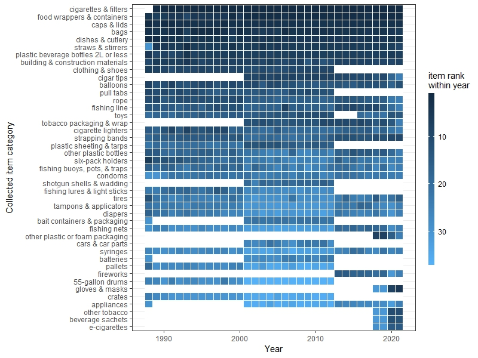

# CAplastics

Exploratory and analytical workflows for harmonizing California Coastal Cleanup datasets and visualizing statewide plastic pollution patterns.

## Repository layout

- `CAplastics.Rproj` – RStudio project file configured so scripts can use `here()` for file paths.
- `data/`
  - `raw/` – source spreadsheets supplied by the California Coastal Cleanup program and Ocean Conservancy.
  - `processed/` – intermediate tables generated by the scripts (for example the harmonised Ocean Conservancy exports and spatial-ready tables).
  - `unused/` – reference materials such as county level CCD tables, GIS coastlines, and distance calculations that are not yet incorporated in the core workflow.
  - `data_citations.*` – citations for geospatial reference files (e.g., California shoreline shapefiles).
- `figures/` – static graphics and documentation exported from the analysis scripts, including the decision flow diagram used for data filtering, publication-ready plots, and supporting PDFs.
- `scripts/` – R scripts and R Markdown notebooks that wrangle data, generate derived datasets, and produce figures or tables.

{width="600"}

## Data inventory

### Raw datasets

- **`data/raw/Coastalcleanupday_data.xlsx`** – statewide Coastal Cleanup Day totals reported by the California Coastal Commission for 1988–2017. Each row is a debris item (e.g., bags, bottles, cigarette butts) with the reported source sector, annual counts, grand totals, and proportional contribution to the cumulative statewide tally.【7bbcc5†L1-L10】
- **`data/raw/OceanConservancy_CA.xlsx`** – Ocean Conservancy’s itemized records for 2016–2020 cleanup sites in California. The file contains rich metadata (cleanup ID, location name, coordinates, effort, and distance surveyed) alongside counts for 50+ plastic item categories per event.【200e5d†L1-L7】
- **`data/raw/OC_CA_2021_2022.xlsx`** – the extended Ocean Conservancy extract covering 2021–2022. Additional columns track environmental context, organiser contact information, shore-based distance metrics, and expanded packaging categories used in the new data system.【d7a78f†L1-L8】

### Processed datasets

- **`data/processed/coarse_data_relational_table.xlsx`** – lookup table created to align detailed CCD and Ocean Conservancy item names into 43 shared “coarse” plastic categories. Scripts join against this file to translate between naming conventions before aggregating counts.【8a1f13†L1-L6】
- **`data/processed/OC_tidy.csv`** – deduplicated, filtered Ocean Conservancy records restricted to Coastal Cleanup Day (CCD) aligned events (2016–2022) and September 2020’s “cleanup month”. The script drops ambiguous “Clean Swell” categories, removes county-level summary submissions, and excludes observations collecting fewer items than volunteers before saving this table for downstream analyses.【5a1f92†L20-L147】【adf5c5†L1-L8】
- **`data/processed/spatialdata_01_main.csv`** – spatial analysis ready table that removes county-wide aggregates, collapses detailed item counts into the shared coarse categories, and retains one row per cleanup with geometry-ready GPS strings.【039678†L18-L109】【1f2af9†L1-L8】
- **`data/processed/spatialdata_02_no2020.csv`** – September 2020 cleanups are dropped from the spatial table to support analyses that focus on typical CCD events rather than the COVID-era cleanup month.【bac814†L1-L39】【5324cd†L1-L8】

### Auxiliary resources

- `data/unused/` contains supplemental CCD breakdowns by county, San Diego-specific tables, pre-computed cleanup-to-ocean distances, and shoreline shapefiles for exploratory work.【a45577†L1-L6】【82617c†L1-L4】
- `figures/` stores derived graphics such as the coarse-category heatmaps, normalized boxplots, ranked summary tables, and the data-decision flow chart referenced by the processing scripts.【b20ea0†L1-L6】

## Data processing and analysis workflow

### Harmonising CCD and Ocean Conservancy records

1. **Ocean Conservancy data consolidation (`scripts/process_oc.R`)** – Combines the legacy (through 2020) and new (2021–2022) Ocean Conservancy spreadsheets, standardises column names, merges split item fields (e.g., clothing and footwear, foam packaging variants), and keeps only CCD-aligned collection dates. The script removes duplicate submissions, strips “Clean Swell” categories, and filters out events where the ratio of total items to volunteers is <1 before exporting `OC_tidy.csv`.【5a1f92†L20-L147】
2. **Coarse category mapping (`scripts/fig_coarse_heatmap.R`, `scripts/fig_coarse_boxplot.R`, `scripts/table_coarse_data.R`)** – These scripts read the CCD statewide counts and the filtered Ocean Conservancy data, join against the coarse category lookup table, and reshape the records to long format so shared categories can be compared across decades.【d479c1†L14-L148】【afe813†L14-L196】【237ddf†L15-L166】

### Temporal ranking, visualization, and summaries

- **Heatmap of annual ranks (`scripts/fig_coarse_heatmap.R`)** – After combining CCD totals (1988–2015, 2018–2020) with Ocean Conservancy-derived counts for 2016–2017, the script calculates within-year ranks for each coarse category and renders a heatmap that highlights how the prominence of items has shifted over time.【d479c1†L68-L170】
- **Boxplots of counts vs. volunteer-normalised intensity (`scripts/fig_coarse_boxplot.R`)** – Generates paired log-scaled boxplots for the top 20 coarse categories showing (A) annual item counts from 1988–2020 and (B) counts normalised by volunteer participation during 2016–2020, clarifying whether effort explains temporal variability.【afe813†L152-L213】
- **Summary table (`scripts/table_coarse_data.R`)** – Produces a ranked table of the most prevalent coarse categories with the number of years observed, mean and median rank across the full record, mean volunteer-normalised counts, and cumulative totals. The table is exported via `kableExtra` for dissemination.【237ddf†L169-L209】

### Spatial analyses and hotspot exploration

- **Spatial preprocessing (`scripts/process_spatial01.R`)** – Removes county-wide summary submissions, converts cleanup-level counts into the coarse categories, and saves a wide-format table suitable for mapping and spatial joins (`spatialdata_01_main.csv`).【039678†L34-L109】
- **Scenario filtering (`scripts/process_spatial02.Rmd`)** – Drops all 2020 cleanups to create `spatialdata_02_no2020.csv` for analyses focused on typical CCD operations.【bac814†L23-L40】
- **Census overlays and buffer experiments (`scripts/process_spatial03.Rmd`)** – Demonstrates how to convert cleanup points to `sf` objects, join them with 2017–2021 ACS census tract geometries, and quantify overlapping cleanups by buffering September 2020 points at 500 m. The notebook currently exports a placeholder `spatialdata_03_2020_500m.csv` and documents outstanding work on overlap removal logic.【09b383†L1-L319】
- **Extended buffering (`scripts/process_spatial04.Rmd`)** – Scaffold for repeating the buffer-and-prune workflow at a 1 km radius; code is pending finalisation once the 500 m workflow is complete.【6dd7ee†L1-L52】
- **Exploratory hotspot notebook (`scripts/hotspots_sr.Rmd`)** – Earlier prototype following similar steps (filtering CCD dates, removing non-plastic categories, creating `sf` geometries, census joins, and 500 m buffering) that informed the dedicated spatial processing scripts.【ec49fd†L27-L320】

## Figures and supporting documents

Key outputs already committed to `figures/` include:

- `coarse_heatmap.jpeg` – annual rank heatmap generated by `fig_coarse_heatmap.R`.
- `boxplot_both_counts.jpeg` and `coarse_heatmap_normalized.jpeg` – companion visuals from the boxplot script showing raw and normalised distributions.
- `table_coarse_categories.png` – rendered version of the summary table for coarse categories.
- `Untitled Diagram.drawio` and `explore_outliers_OCdata.pdf` – process documentation summarising data-filtering decisions and outlier investigations referenced in the scripts.【b20ea0†L1-L6】

## Reproducing the workflow

1. **Set up R environment** – Open the project in RStudio via `CAplastics.Rproj`. All scripts expect the working directory to resolve through `here::here()`.
2. **Install required packages** – The scripts rely on `tidyverse`, `lubridate`, `readxl`, `here`, `janitor`, and (for later steps) `car`, `cowplot`, `kableExtra`, `sf`, `tmap`, `rgeos`, and `tidycensus` as noted at the top of each script.【5a1f92†L13-L18】【afe813†L7-L28】【09b383†L11-L23】
3. **Regenerate Ocean Conservancy extracts** – Run `source("scripts/process_oc.R")` to rebuild `OC_tidy.csv` from the raw spreadsheets. This step harmonises the 2016–2022 data and enforces the cleanup quality filters described above.【5a1f92†L20-L147】
4. **Create coarse-category aggregates** – Execute `fig_coarse_heatmap.R`, `fig_coarse_boxplot.R`, and `table_coarse_data.R` to join CCD and Ocean Conservancy data via the coarse lookup table, generate ranked datasets, and produce the heatmap, boxplots, and summary table artifacts.【d479c1†L68-L170】【afe813†L152-L233】【237ddf†L169-L209】
5. **Prepare spatial datasets** – Run `process_spatial01.R` (and optionally `process_spatial02.Rmd`) to produce the cleanup-level wide tables used for spatial joins and to exclude pandemic-era events when desired.【039678†L34-L109】【bac814†L23-L40】
6. **Explore hotspots (optional)** – Knit `process_spatial03.Rmd` or `hotspots_sr.Rmd` to recreate the census overlay maps and buffer analyses. These notebooks currently contain exploratory code and TODOs for overlap handling; review comments before relying on the outputs.【09b383†L197-L319】【ec49fd†L201-L320】

## Project status and next steps

- Integrate the September 2020 buffer logic into a reproducible script that exports cleaned hotspot datasets (e.g., finish `process_spatial03.Rmd` and port the workflow into `process_spatial04.Rmd`).【09b383†L291-L318】【6dd7ee†L31-L52】
- Expand the `data_citations` file with full references for CCD and Ocean Conservancy datasets to accompany the existing shoreline citation.【82617c†L1-L4】
- Automate figure generation by orchestrating scripts (e.g., with `targets` or `renv`) once filtering rules are finalised.
